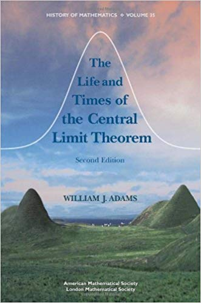

## Classical - Central limit theorem

**Fundamental theorem in statistics**

Let $X_1, X_2, \ldots X_n$ be a sequence of $n$ indipendent identically distributed random variables, from __any__ distribution with 

* (finite) mean $\mathbb{E}(X_i) = \mu$ 
* (finite) variance $\mathbb{V}ar(X_i) = \mathbb{E}(X_i -\mu)^2 = \sigma^2$.  

For large $n$ the sample mean $\bar{X} = \frac{X_1 + X_2 + \dots + X_n}{n}$ follows an approximate normal distribution with

* mean $\mathbb{E}(\bar{X}) = \mu$, variance $\mathbb{V}ar(\bar{X}) = \sigma_{\bar{X}}^2 = \frac{\sigma^2}{n}$

$$\bar{X} \xrightarrow[]{\; d \;} \mathcal{N}\left(\mu, \frac{\sigma^2}{n}\right), \quad Z_n =\frac{\bar{X} - \mu}{\sigma/\sqrt{n}} \xrightarrow[]{\; d \;} \mathcal{N}\left(0, 1\right)$$

The sampling distribution of the sample mean is approximately normal regardless of the distribution of the underlying sample.

---

## Central limit theorem - sketch of proof

We can write $Z_n = \sum_{i=1}^n \frac{X_i - \mu}{\sigma \sqrt{n}} = \sum_{i=1}^n \frac{Y_i}{\sqrt{n}}$, with $Y_i = \frac{X_i - \mu}{\sigma}$

By the properties of the characteristic function, defined as $\varphi_X(t) = \mathbb{E}(e^{-itX})$ for a random variable $X$, and given that $Y_i$'s are iid, we get the following for $Z_n$

$$\varphi_{Z_n}(t) = \left[ \varphi_{Y_1} \left( \frac{t}{\sqrt{n}} \right) \right]^n$$
By Taylor's theorem: $\varphi_{Y_1}(t/\sqrt{n}) = 1-\frac{\sigma^2}{2}t^2 + O(t^3)$, 
so that

$$\varphi_{Z_n}(t) = \left( 1-\frac{\sigma^2}{2}t^2 + O(t^3) \right)^n \longrightarrow e^{-\frac{1}{2}t^2}, \quad n \rightarrow \infty$$
characteristic function of a standard normal r.v., with Levy's continuity theorem to bridge pointwise convergence of the characteristic function to convergence in distribution and complete the proof.

Lyapunov extension to unequal means and variances:  
$\frac{1}{s_n} \sum_{i=1}^n (X_i-\mu_i) \xrightarrow[]{\; d \; } \mathcal{N}(0,1)$,
with $s_n^2 = \sum_{i=1}^n \sigma_i^2$

--- &twocol

## Cauchy distribution

*** =left

Continuous random variable $X$ with Cauchy distribution

* probability density function

$$f(x; x_0, \gamma) = \frac{1}{\pi\gamma \left[ 1 + \left( \frac{x-x_0}{\gamma} \right)^2 \right]}$$

* with location $x_0$, scale $\gamma>0$, mean and variance **undefined**

$$X \thicksim \mathrm{Cauchy}(x_0, \gamma)$$

* cumulative distribution function

$$F(x; x_0, \gamma) = \frac{1}{\pi}\arctan\left( \frac{x-x_0}{\gamma} \right) + \frac{1}{2}$$

*** =right

```{r simCauchy, fig.height=7}
## plotCTL(smalln, bigN, rdist="rcauchy")
set.seed(23)
set.seed(37)
x_bar <- NULL
for(j in 1:bigN){
    x_sample <- rcauchy(smalln)
    x_bar[j] <- mean(x_sample)
    }
  dat <- data.frame(x=x_sample, x_bar=x_bar)
  # Histogram overlaid with kernel density curve
  h1 <- ggplot(dat, aes(x=x)) + 
    geom_histogram(aes(y=..density..),      # Histogram with density instead of count on y-axis
                   colour="dodgerblue", fill="white") +
      geom_density(alpha=.3, colour="darkorange", fill="darkorange")  # Overlay with transparent density plot
  
  h2 <- ggplot(dat, aes(x=x_bar)) + 
    geom_histogram(aes(y=..density..),      # Histogram with density instead of count on y-axis
                   colour="dodgerblue", fill="white") +
    geom_density(alpha=.3, colour="darkorchid4", fill="darkorchid4")  # Overlay with transparent density plot
  
  xn <- seq(min(x_bar), max(x_bar), length.out = 100)  
  df <- with(dat, data.frame(xn=xn, y = dnorm(xn, mean(x_bar), sd(x_bar))))
  h2 <- h2 + geom_line(data = df, aes(x = xn, y = y), color = "red")
  
grid.arrange(h1, h2, ncol = 1)
```

--- &jtwocol w1:48% w2:48%

## The Quincunx

*** =left
Example of a Galton board/box or quincunx

 &nbsp; 

* Sir Francis Galton (1893)
* physical demonstration of the CLT

*** =right
<br>
[http://galtonboard.com/]


<!-- _Quincunx is a good scrabble word!  Galton along with being the half-cousin of Darwin was also the "father" of eugenics!_ -->

--- &twocol

## Historical notes

*** =left

* 1733: early version, for binomial distribution with $p=1/2$, by Abraham de Moivre  
(44 years before Gauss' birth)
* 1812: extended by Pierre-Simon Laplace
* 1920: named __Central Limit Theorem__ by George Pólya

*** =right 



<!-- Inspired by https://www.johndcook.com/blog/2010/01/05/how-the-central-limit-theorem-began/ -->

---

## References

Course from Penn State
https://onlinecourses.science.psu.edu/stat414/node/176/

https://www.johndcook.com/blog/central_limit_theorems/
https://www.johndcook.com/blog/2010/01/05/how-the-central-limit-theorem-began/

Animate a Monte Carlo simulation
https://roh.engineering/post/animating-a-monte-carlo-simulation/

https://freakonometrics.hypotheses.org/52347

https://www.learner.org/courses/mathilluminated/units/7/textbook/06.php

http://www.sthda.com/english/wiki/ggplot2-histogram-plot-quick-start-guide-r-software-and-data-visualization

https://www.wikiwand.com/en/De_Moivre%E2%80%93Laplace_theorem

<style>

.title-slide {
  background-color: #FFFFFF;
}

.title-slide hgroup > h1{
font-size: 180% ;
}

.title-slide hgroup > h1, 
.title-slide hgroup > h2 {
  color: #005579 ; /* novartis blue, #116BB1 eth blue, #EF5150 default*/
}

slide.segue h2 {
  color: #005579 ; /* novartis blue, #116BB1 eth blue, #EF5150 default*/
}

slide:not(.segue) h2 {
  color: #005579 ; /* novartis blue, #116BB1 eth blue, #EF5150 default*/
}

/* Styles for Title Slide */
.title-slide hgroup > h1{
  font-family: "Open Sans Condensed", 'Garamond', 'Calibri', sans-serif;
  font-weight: 700;
}

.title-slide hgroup > h2{
  font-family: "Open Sans Condensed", 'Garamond','Calibri', sans-serif;
  font-weight: 700;
  font-size: 150% ;
}

slide p {
 font-family: 'Open Sans','Helvetica', 'Crimson Text', 'Garamond',  'Palatino', sans-serif;
 color: #444444 ;
 font-size: 80%
} 

footer p {
 font-family: 'Open Sans','Helvetica', 'Crimson Text', 'Garamond',  'Palatino', sans-serif;
 color: #444444 ;
} 

p.cite {
  color: #005579 ; /* novartis blue, #116BB1 eth blue, #EF5150 default*/
  font-size: 67% ;
}

em {
  color: #005579 ; /* novartis blue, #116BB1 eth blue, #EF5150 default*/
  font-size: 67% ;
  /*font-style: italic*/
}

strong {
  color: #005579 ; /* novartis blue, #116BB1 eth blue, #EF5150 default*/
  /*font-size: 67% */;
  font-weight: bold;
}

mark {
  background-color:transparent;
  color: #888888 ;
  font-size: 67% ;
  /*font-style: italic*/
}

/* Fonts and Spacing */
article p, article li, article li.build, section p, section li{
  text-align: left;
}

footnote {
  position: absolute;
  bottom: 0;
  margin-bottom: 10px;
  width: 80%;
  font-size: 67%;
  line-height: 1.5;
}

table th {
  background: #99bbc9;
  color: #005579;
  text-transform: uppercase;
}
table td {
  border-bottom: 1px solid #CFCEBD;
}
table tr:nth-child(2n) {
  background: #d6e3e9;
}
table tr:nth-child(2n+1) {
  background: #ffffff;
}

#hidestuff {margin-top:-124px;}
#hidestuffless {margin-top:-100px;}
#hidestuffevenless {margin-top:-75px;}
#hidestuffpic {margin-top:-200px;}
#hidestuffbigpic {margin-top:-250px;}

#testfooter {
  font-size: 12pt;
  position: absolute;
  bottom: 20px;
  right: 60px;
  line-height: 1.9;
}

#testfooter:after {
   content: "/10";
}

/* change logo size */
aside.gdbar img {
  width: 504px; 
  height: 68px; 
  position: absolute;
  right: 0;
  margin: 15px 15px;
}

/* change logo background */
aside.gdbar {
  height: 100px;
  width: 281px;
  position: absolute;
  left: 10px;
  top: 125px;
}

aside.gdbar {
  width: 534px; 
}

/* Reduce Space between Title and Body */
slides > slide > hgroup + article {
  margin-top: 30px;
}

slides > slide:not(.nobackground):after {
  font-size: 12pt;
  content: "";
  position: absolute;
  bottom: 20px;
  right: 60px;
  line-height: 1.9;
}

</style>
